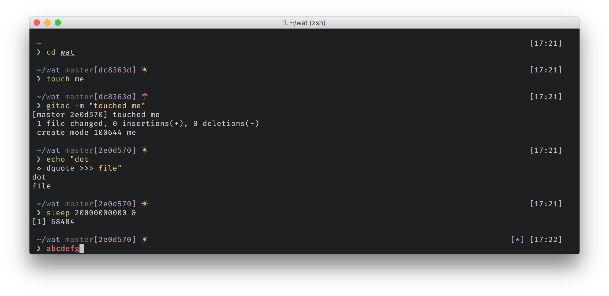
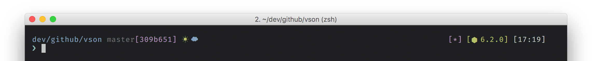

# Blox

> Clean, modular ZSH theme


*Screenshot: Blox theme with default settings, base16-default, Fira-Code and zsh-syntax-highlighting*

Blox is a minimal and fast ZSH theme that shows you what you need. It consists of blocks: each block is shown inside a pair of [square brackets].

It's highly customizable - you can add blocks by simply creating a function.

---

## Install

This theme was tested on all the following methods, but it should be compatible with almost every zsh framework / plugin manager / whatever.

### For antigen users

Simply add the following into your `~/.zshrc`

```console
antigen bundle yardnsm/blox-zsh-theme
```

### For zgen users

Similarly to antigen, just add the following to your `~/.zshrc`:

```console
zgen load yardnsm/blox-zsh-theme
```

### For antibody users

Again, just add the following to your `~/.zshrc`:

```console
antibody bundle yardnsm/blox-zsh-theme
```

### For oh-my-zsh users

1. Symlink (or copy) `blox.zsh` to `~/.oh-my-zsh/custom/themes/blox.zsh-theme`.
2. Set `ZSH_THEME="blox"` in your `.zshrc` file.

### Manual installation

1. Get the file `blox.zsh`; Either:
  - Clone this repo
  - add it as a submodule
  - just download `blox.zsh`
2. `source` it. Simply put the following in your `~/.zshrc`:
```console
source PATH_FOR_BLOX.zsh
```

---

## Hacking

### Building from source

To build the theme from source, simply run `build.sh`. It will concatenate all of the files in `src` into one, (not so) big file.

```console
./build.sh
```

---

## The prompt



The main idea of this theme is dividing the prompt into blocks. The blocks are modular and they could be arranged and modified. Each block has its options, which can also be customized.

The following sections describe the built-in blocks and their customizing options.

### Core options

| Variable | Default | Meaning |
| :------- | :------ | :------ |
| `BLOX_CONF__BLOCK_PREFIX` | `'['` | Block's prefix |
| `BLOX_CONF__BLOCK_SUFFIX` | `']'` | Block's suffix |
| `BLOX_CONF__ONELINE` | `false` | **When setting to `true`, the lower segments will be disabled** |

### Built-in blocks

#### `blox_block__cwd`

Displays the current working directory.

| Variable | Default | Meaning |
| :------- | :------ | :------ |
| `BLOX_BLOCK__CWD_COLOR` | `'blue'` | This block's color |
| `BLOX_BLOCK__CWD_TRUNC` | `3` | Number of folders of cwd to show in prompt (0 to show all) |

#### `blox_block__symbol`

The prompt's symbol.

| Variable | Default | Meaning |
| :------- | :------ | :------ |
| `BLOX_BLOCK__SYMBOL_COLOR` | `'cyan'` | The symbol's color |
| `BLOX_BLOCK__SYMBOL_EXIT_COLOR` | `'red'` | The symbol's color when last command didn't exit with `0` |
| `BLOX_BLOCK__SYMBOL_SYMBOL` | `'❯'` | The symbol |
| `BLOX_BLOCK__SYMBOL_EXIT_SYMBOL` | `'❯'` | The symbol when last command didn't exit with `0` |
| `BLOX_BLOCK__SYMBOL_ALTERNATE` | `'◇'` | Alternate symbol (used as PROMPT2) |

#### `blox_block__git`

Shows git info.

| Variable | Default | Meaning |
| :------- | :------ | :------ |
| `BLOX_BLOCK__GIT_CLEAN_COLOR` | `'green'` | Clean color |
| `BLOX_BLOCK__GIT_CLEAN_SYMBOL` | `'☀︎'` | Clean symbol |
| `BLOX_BLOCK__GIT_DIRTY_COLOR` | `'red'` | Dirty color |
| `BLOX_BLOCK__GIT_DIRTY_SYMBOL` | `'☂'` | Dirty symbol |
| `BLOX_BLOCK__GIT_UNPULLED_COLOR` | `'red'` | Needs pull color |
| `BLOX_BLOCK__GIT_UNPULLED_SYMBOL` | `'✈︎'` | Needs pull symbol |
| `BLOX_BLOCK__GIT_UNPUSHED_COLOR` | `'blue'` | Needs push color |
| `BLOX_BLOCK__GIT_UNPUSHED_SYMBOL` | `'☁︎'` | Needs push symbol |

#### `blox_block__host`

Shows host info (user@machine).

| Variable | Default | Meaning |
| :------- | :------ | :------ |
| `BLOX_BLOCK__HOST_USER_SHOW_ALWAYS` | `false` | If false, the username will be shown only if `$LOGNAME` is different from the current logged user. |
| `BLOX_BLOCK__HOST_USER_COLOR` | `'yellow'` | User info color |
| `BLOX_BLOCK__HOST_USER_ROOT_COLOR` | `'red'` | The color to show when the logged user is root. |
| `BLOX_BLOCK__HOST_MACHINE_SHOW_ALWAYS` | `false` | If false, the working machine name is shown only in SSH session. |
| `BLOX_BLOCK__HOST_MACHINE_COLOR` | `'cyan'` | The machine name color |

#### `blox_block__bgjobs`

Shows indicator if there are background jobs running.

| Variable | Default | Meaning |
| :------- | :------ | :------ |
| `BLOX_BLOCK__BGJOBS_SYMBOL` | `'*'` | The indicator to show |
| `BLOX_BLOCK__BGJOBS_COLOR` | `'magenta'` | The block's color |

#### `blox_block__time`

Shows the time in `HH:mm` format

#### `blox_block__nodejs`

Shows nodejs version if there is a `package.json` file in the working directory.

| Variable | Default | Meaning |
| :------- | :------ | :------ |
| `BLOX_BLOCK__NODEJS_SYMBOL` | `'⬢'` | The indicator to show |
| `BLOX_BLOCK__NODEJS_COLOR` | `'green'` | The block's color |

#### `blox_block__ruby`

Shows ruby version if there is a `Gemfile` file in the working directory.

| Variable | Default | Meaning |
| :------- | :------ | :------ |
| `BLOX_BLOCK__RUBY_SYMBOL` | `'♢'` | The indicator to show |
| `BLOX_BLOCK__RUBY_COLOR` | `'red'` | The block's color |

---

## Further Customizing

### Creating blocks

A block is just a simple function that `echo` the result. For example:

```shell
function blox_block__helloworld() {
  echo "${BLOX_CONF__BLOCK_PREFIX}hello world${BLOX_CONF__BLOCK_SUFFIX}"
}
```

It is recommended to prefix the function's name with `blox_block__`.

### Setting the structure

The prompt consists of 4 segments: upper left, upper right, lower left and lower right. You can set the value of each segment by simply change it's value. The value should be a comma-separated list of block names.

You can make the prompt oneline instead of multiline by changing the value of `BLOX_CONF__ONELINE`. **This will disable the lower segments!**

| Variable | Default |
| :------- | :------ |
| `BLOX_SEG__UPPER_LEFT` | `'blox_block__host,blox_block__cwd,blox_block__git'` |
| `BLOX_SEG__UPPER_RIGHT` | `'blox_block__bgjobs,blox_block__ruby,blox_block__nodejs,blox_block__time'` |
| `BLOX_SEG__LOWER_LEFT` | `'blox_block__symbol'` |
| `BLOX_SEG__LOWER_RIGHT` | `''` |

---

## TODOs:

- [ ] **Add more git info**
- [ ] Add an option for dividers between common blocks (user-info, cwd, git...)
- [ ] What about a customizable structure for the git block?

---

## License

MIT © [Yarden Sod-Moriah](http://yardnsm.net/)
